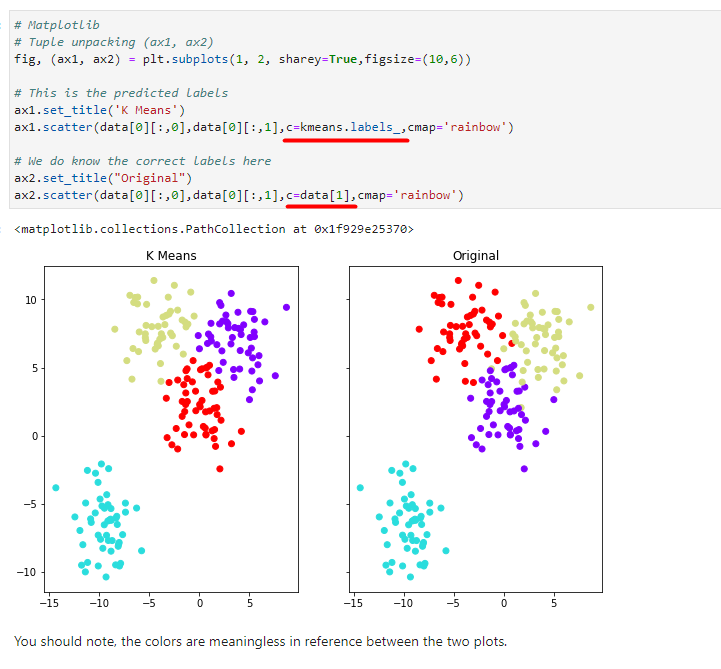
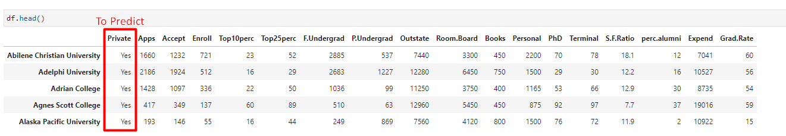

# K-Means-Clustering-Unsupervised

K Means Clustering is an unsupervised learning algorithm that tries to cluster data based on their similarity. Unsupervised learning means that there is no outcome to be predicted, and the algorithm just tries to find patterns in the data. 

In k means clustering, we have the specify the number of clusters we want the data to be grouped into. The algorithm randomly assigns each observation to a cluster, and finds the centroid of each cluster. Then, the algorithm iterates through two steps: 

Reassign data points to the cluster whose centroid is closest. Calculate new centroid of each cluster. 

These two steps are repeated till the within cluster variation cannot be reduced any further. The within cluster variation is calculated as the sum of the euclidean distance between the data points and their respective cluster centroids.

# For this project we will attempt to use KMeans Clustering to cluster Universities into to two groups, Private and Public.

It is very important to note, we actually have the labels for this data set, but we will NOT use them for the KMeans clustering algorithm, since that is an unsupervised learning algorithm.

When using the Kmeans algorithm under normal circumstances, it is because you don't have labels. In this case we will use the labels to try to get an idea of how well the algorithm performed, but you won't usually do this for Kmeans, so the classification report and confusion matrix at the end of this project, don't truly make sense in a real world setting.

EDA: 

Create a scatterplot of Grad.Rate versus Room.Board where the points are colored by the Private column.

Create a stacked histogram showing Out of State Tuition based on the Private column. Try doing this using sns.FacetGrid.

Notice how there seems to be a private school with a graduation rate of higher than 100%. What is the name of that school?

K Means Cluster Creation

Fit the model to all the data except for the Private label.

Evaluation:

There is no perfect way to evaluate clustering if you don't have the labels, however since this is just an exercise, we do have the labels, so we take advantage of this to evaluate our clusters, keep in mind, you usually won't have this luxury in the real world.

Create a new column for df called 'Cluster', which is a 1 for a Private school, and a 0 for a public school.

Create a confusion matrix and classification report to see how well the Kmeans clustering worked without being given any labels.
